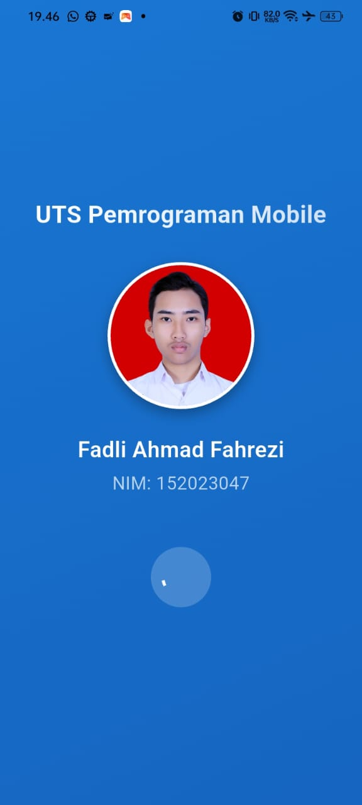
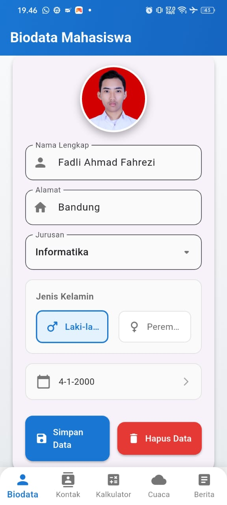
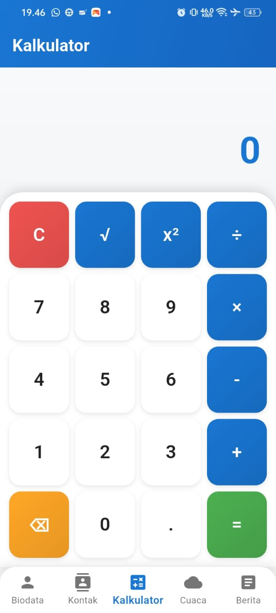
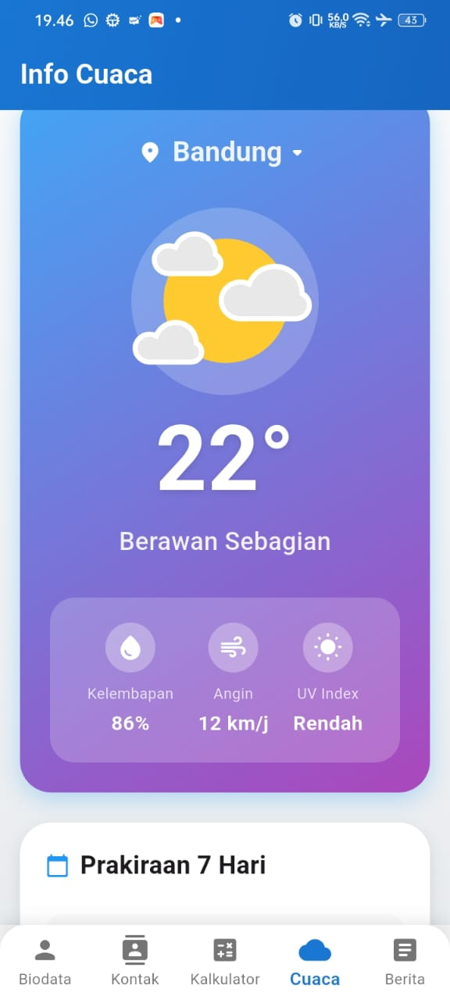
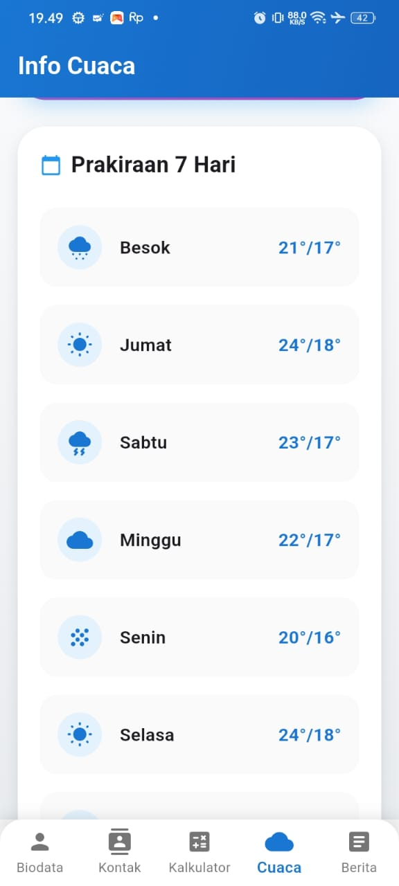

# UTS Pemrograman Mobile - IF 2024/2025

Ini adalah proyek aplikasi mobile yang dibuat menggunakan Flutter untuk memenuhi Ujian Tengah Semester (UTS) mata kuliah Pemrograman Mobile.

## 📜 Deskripsi Aplikasi

Aplikasi ini adalah sebuah *dashboard* yang mencakup 5 (lima) fitur utama yang di-host dalam satu aplikasi dengan navigasi *bottom navigation bar*. Setiap halaman didesain sesuai dengan fungsionalitasnya, mulai dari input data hingga kalkulator fungsional. 

---

## ✨ Fitur Utama

Aplikasi ini terdiri dari beberapa halaman utama:

1.  **Splash Screen:** Tampilan splash screen aplikasi selama 5 detik yang menampilkan identitas .
2.  **Dashboard:** Halaman utama dengan *Bottom Navigation* untuk berpindah antar halaman.
3.  **Biodata:** Halaman formulir untuk input data diri (Nama, Alamat, Jurusan, Gender, Tanggal Lahir) yang disimpan secara lokal menggunakan `shared_preferences`.
4.  **Kontak:** Halaman yang menampilkan daftar kontak statis menggunakan `ListView`. 
5.  **Kalkulator:** Kalkulator fungsional yang dapat melakukan operasi tambah, kurang, kali, bagi, kuadrat, dan akar kuadrat.
6.  **Cuaca:** Tampilan UI statis untuk informasi cuaca di 2 kota (Bandung dan Jakarta) dengan animasi Lottie dan prakiraan 7 hari.
7.  **Berita:** Halaman yang menampilkan daftar berita statis dalam bentuk `Card` dan dapat diklik untuk melihat detailnya.

---

## 📸 Tangkapan Layar (Screenshot)

Sesuai dengan ketentuan UTS, berikut adalah tangkapan layar (screenshot) dari semua halaman yang telah dikembangkan:

### 1. Splash Screen
*Deskripsi: Halaman loading awal 5 detik dengan nama dan NIM.*
 

### 2. Halaman Biodata
*Deskripsi: Halaman formulir dengan input teks, dropdown, radio button kustom, dan date picker. Data tersimpan di HP.* 
 

### 3. Halaman Kontak
*Deskripsi: Tampilan daftar 15 kontak statis menggunakan Card dan ListView.* 
 

### 4. Halaman Kalkulator
*Deskripsi: Kalkulator fungsional dengan layout responsif yang dapat menghitung operasi dasar, kuadrat, dan akar.*
 

### 5. Halaman Cuaca
*Deskripsi: Tampilan info cuaca dengan pilihan 2 kota, animasi Lottie, dan prakiraan 7 hari.* 
 

### 6. Halaman Berita
*Deskripsi: Tampilan daftar berita menggunakan Card yang bisa di-scroll dan diklik untuk melihat detail.*
 

---

## 👤 Author

* **Nama:** Fadli Ahmad Fahrezi
* **NIM:** 152023047
* **Kelas:** BB
